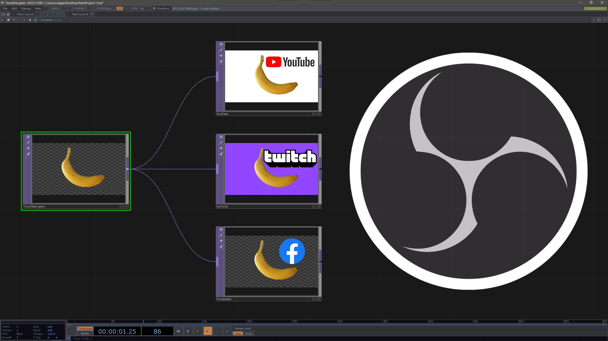

# Automation and Remote Control with OBS WebSockets

2020 has been a year all about remote workflows, streaming content, and imagining new approaches to solving the challenges of events - both physical and virtual. There are lots of ways to stream your own events with TouchDesigner, but where do you get started? What tools should you use? What kind of a pipeline makes sense? How can you make sure your decisions will scale easily, or work on multiple computers? 

In this workshop we’ll look at a workflow that uses TouchDesigner to control OBS (Open Broadcaster Software) with WebSockets. It’s often tempting to do a whole project with just TouchDesigner, and while there are lots of ways to steam directly to the web with TD, it can often be helpful to break apart your pipeline both for efficiency and to safeguard against the unexpected. We’ll start the workshop by talking through possible video and hardware configurations, and then look at how we can use WebSockets to help create systems for remote control of OBS. We’ll see how to control OBS when it’s running on the same computer, or another machine altogether.

Finally we’ll look specifically at how we can use a Python Extension in TouchDesigner to change scenes, set transitions, adjust audio controls, control your stream and record your output.  By the end of this workshop you’ll have a custom widget that you can use for streaming your own virtual events with OBS.

Topics covered in this workshop will include:
* Streaming pipelines and system flow
* WebSockets
* Python Extensions in TouchDesigner
* Custom Parameters
* OBS (Open Broadcaster Software)
* Controlling OBS from TouchDesigner
    * Changing Scenes
    * Setting Transitions
    * Adjusting Audio Levels
    * Start and Stop Recording
    * Start and Stop Streaming

Tools we’ll use and explore in the workshop:
* [TouchDesigner 099 2020.27390](https://derivative.ca/download)
* [OBS](https://obsproject.com/)
* [OBS Websocket](https://obsproject.com/forum/resources/obs-websocket-remote-control-obs-studio-from-websockets.466/)
    * [OBS Websocket API](https://github.com/Palakis/obs-websocket/blob/4.x-current/docs/generated/protocol.md)
* [What are Websockets](https://en.wikipedia.org/wiki/WebSocket)
* [WebSocket.org](http://websocket.org/echo.html)
